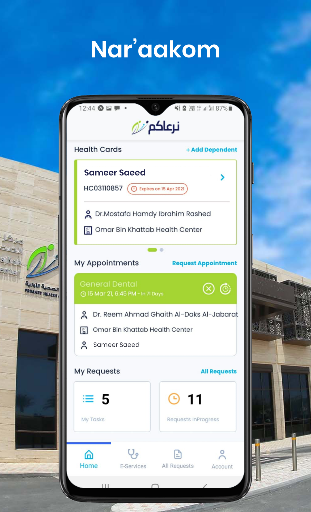
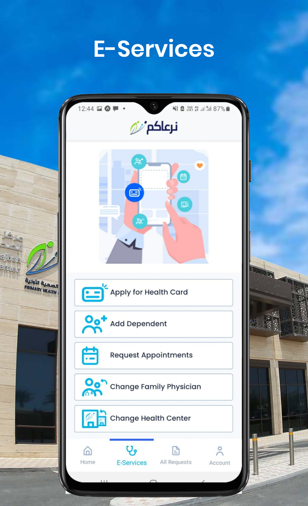
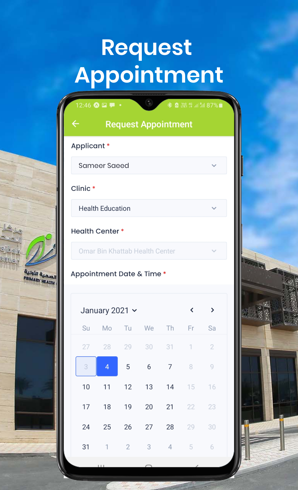
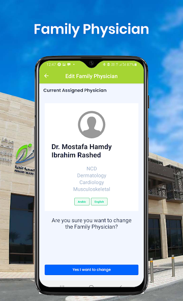
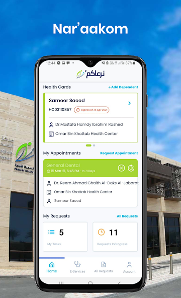

# Nar-aakom-mobile-app
Nar’aakom is a cross-platform healthcare mobile app built using React Native to connect patients, doctors, and healthcare providers seamlessly. The app enables users to manage appointments, access medical records, receive health updates, and communicate with healthcare professionals — all from a unified interface
# 🏥 Nar’aakom Mobile App

**Nar’aakom Mobile App** is a healthcare application built using **React Native**, designed to connect patients, doctors, and healthcare providers through a unified mobile platform.  
It enables users to manage appointments, communicate securely with healthcare professionals, and access personal medical records conveniently on both Android and iOS.

---

## 📱 Overview

The app provides a seamless healthcare experience by offering features such as online appointment booking, doctor-patient chat, medical record management, and push notifications for reminders and updates.  
It is built to ensure data security, scalability, and cross-platform consistency using modern mobile development best practices.

---

## 👨‍💻 My Role: Lead React Native Developer

As the **Lead React Native Developer**, I was responsible for:

- Designing and developing the mobile architecture using **React Native** and **TypeScript**.
- Building reusable and modular UI components.
- Implementing **Redux Toolkit** for global state management.
- Integrating **REST APIs** for authentication, appointments, and chat functionality.
- Setting up **Firebase** for authentication, messaging, and analytics.
- Ensuring responsive design and accessibility across Android and iOS.
- Leading the mobile development team and reviewing code for consistency and performance.
- Coordinating with backend developers and UI/UX designers for feature alignment.

---

## 🧩 Core Features

- 🩺 **Appointment Booking:** Patients can schedule, view, or cancel appointments with ease.  
- 💬 **Doctor–Patient Chat:** Real-time communication channel with message history.  
- 📄 **Medical Records:** Secure upload and access to prescriptions, reports, and documents.  
- 🔔 **Push Notifications:** Appointment reminders, new messages, and important updates.  
- 👤 **Profile Management:** Manage patient information and health preferences.  
- 🌍 **Multi-platform Support:** Compatible with both Android and iOS.  

---

## 🧰 Tech Stack

| Category | Technology |
|-----------|-------------|
| **Framework** | React Native |
| **Language** | TypeScript / JavaScript (ES6+) |
| **State Management** | Redux Toolkit |
| **Navigation** | React Navigation v6 |
| **Backend Integration** | REST API (Axios) |
| **Authentication** | Firebase Auth + JWT |
| **Notifications** | Firebase Cloud Messaging (FCM) |
| **Storage** | AsyncStorage / SecureStore |
| **Build & CI/CD** | GitHub Actions + Fastlane |
| **Version Control** | Git + GitHub |

---

## 🏗️ Folder Structure

naraakom-mobile-app/
│
├── src/
│ ├── assets/
│ │ ├── images/
│ │ └── icons/
│ ├── components/ # Reusable components
│ ├── navigation/ # App navigation setup
│ ├── redux/ # Redux store and slices
│ ├── screens/ # Screen components
│ ├── services/ # API and helper functions
│ ├── utils/ # Utility functions and constants
│ └── App.tsx
│
├── screenshots/
│ ├── image1.png
│ ├── image2.png
│ ├── image3.png
│ ├── image4.png
│ ├── image5.png
│ └── image6.png
│
└── README.md


---

## 🖼️ Screenshots

## 🖼️ Screenshots








---

## ⚙️ Installation & Setup

### Prerequisites
- Node.js (v16 or above)
- React Native CLI or Expo
- Android Studio / Xcode
- Firebase project setup

### Steps
```bash
# Clone the repository
git clone https://github.com/<your-username>/naraakom-mobile-app.git

# Navigate to project directory
cd naraakom-mobile-app

# Install dependencies
npm install

# Start Metro bundler
npx react-native start

# Run on Android
npx react-native run-android

# Run on iOS
npx react-native run-ios
